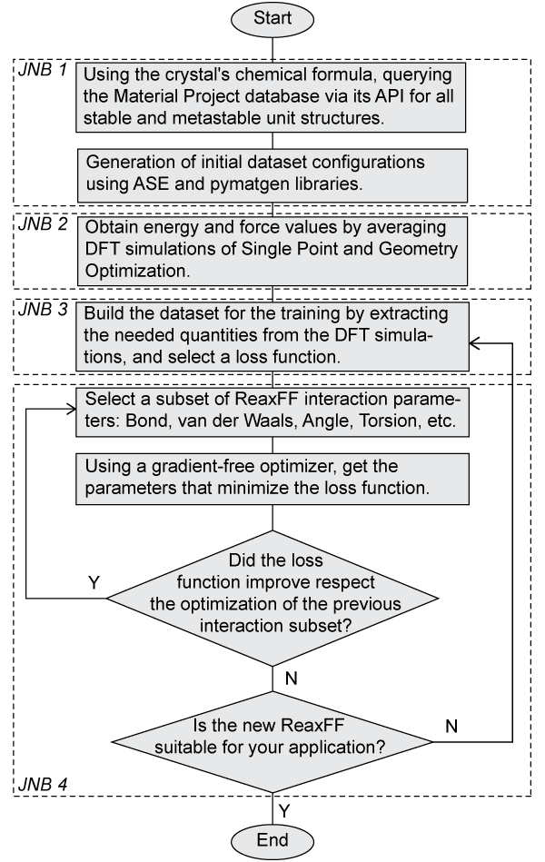

# Enhancing the ReaxFF protocol

[](https://www.nature.com/articles/sdata201618)
[](https://python.org)
[](https://www.linux.org/)
[](CONTRIBUTING.md)
[](https://github.com/psf/black)

[](https://results.pre-commit.ci/badge/github/paolodeangelis/Enhancing_ReaxFF/main.svg)
[](TODO)
[](LICENSE)
[](https://doi.org/10.5281/zenodo.8036775)


This repository contains the jupyter notebooks used to re-parametrize the ReaxFF force field for LiF, an inorganic compound.
The purpose of the set of notebooks is to facilitate the reparameterization ReaxFF force field for LiF. The results and method used were published in the article [Enhancing ReaxFF for Molecular Dynamics Simulations of Lithium-Ion Batteries: An interactive reparameterization protocol][article-doi].

The database containing the simulation data from *ab initio* simulations obtained from this protocol is published in [Enhancing ReaxFF repository DFT Database][enhancing-reaxFF-database-repository].

The Jupyter Notebooks provided here are designed to facilitate the configuration building, execution of DFT simulations, and optimization of the ReaxFF potential, as described in the workflow diagram shown below. To manage the complexity of the overall operation, we have divided the process into four main Jupyter Notebooks, , with an additional auxiliary notebook.




Each notebook can be executed independently, allowing for flexibility in adapting the workflow to optimize the ReaxFF potential for different compounds with minimal modifications.

The four main Jupyter Notebooks cover various aspects of the workflow, including configuration setup, DFT simulations, and ReaxFF optimization. By following the sequence of these notebooks, you will be able to efficiently perform the entire process, from initial configuration generation to the optimization of the ReaxFF potential.


## Table of Contents

* [Installation](#installation)
* [Folder Structure](#folder-structure)
* [Contributing](#contributing)
* [How to Cite](#how-to-cite)
* [License](#license)
* [Acknowledgments](#acknowledgments)

## Installation

To use the protocol and interact with it, ensure that you have the following Python requirements installed:

**Minimum Requirements:**

* Python 3.8 or above
* Atomic Simulation Environment (ASE) library
* Jupyter Lab

**Requirements for Re-running or Performing New Simulations:**

* SCM (Software for Chemistry & Materials) Amsterdam Modeling Suite
* PLAMS (Python Library for Automating Molecular Simulation) library

**Requirements for Re-running ReaxFF optimization:**

* AMS (Amsterdam Modeling Suite) Python Stack ([more info here](https://www.scm.com/doc/Scripting/Python_Stack/Python_Stack.html))

You can install the required Python packages using pip:

```shell
pip install -r requirements.txt
```

> **Warning**
>
> This do not include the ParAMS packages since is available only in AMS Python Stack.
>
> See instruction below.

```shell
export SCM_PYTHONDIR=$(pwd)/venv
$AMSBIN/amspython --install_venv
source venv/AMSYYYY.X.venv/bin/activate # Replace YYYY.X with the correct AMS version
```

> **Warning**
>
> Make sure to have the appropriate licenses and installations of SCM Amsterdam Modeling Suite and any other necessary software for running simulations.

### Configure `Material Project API`

**Get *Material Project* API key**

Access to [Material Project](https://materialsproject.org/) and follow the instruction on the [documentation](https://materialsproject.org/api)

#### Make the configuration file

1.  Run the script replacing `<MATERIAL_PROJECT_KEY>` with the Material Project API key.

```shell
python tools/mpinterface_setup.py -k <MATERIAL_PROJECT_KEY>
```

## Folder Structure

The repository has the following folder structure:

```bash
.
├── CREDITS.md
├── LICENSE
├── README.md
├── requirements.txt
├── assets
├── data
│   └── ffield.reax.optimized.ff
├── tools
├── JNB1-Initial_configrations.ipynb
├── JNB2-Simulations.ipynb
├── JNB3-Build_traingset.ipynb
├── preJNB4-ReaxFF_optimization.ipynb
└── JNB4-ReaxFF_optimization.ipynb
```

* `CREDITS.md`: This file acknowledges and credits the individuals or organizations that have contributed to the repository.
* `LICENSE`: This file contains the license information for the repository (CC BY 4.0). It specifies the terms and conditions under which the repository's contents are distributed and used.
* `README.md`: This file (repository overview and instructions).
* `requirements.txt`: This file lists the required Python packages and their versions (see [installation section](#installation)).
* `assets`: This folder contains any additional assets, such as images or documentation, related to the repository.
* `data`: This folder contains the data files resulting from this work.
  * `ffield.reax.optimized.ff`: This file is the optimized ReaxFF resulting from using these Jupyter notebooks, as explained in the related [journal article][article-doi].
* `notebooks`: This folder contains Jupyter notebooks that provide demonstrations and examples of how to use and analyze the database.
  * `JNB1-Initial_configurations.ipynb`: Jupyter Notebook where the protocol is initialized by querying the *Materials Project* database, downloading the unit crystals, and producing all the initial configurations for the DFT simulations using the *pymatgen* library.
  * `JNB2-Simulations.ipynb`: This notebook performs the simulations using BAND and DFTB codes available in the Amsterdam Modeling Suite. The simulations are performed in parallel using the *PLAMS* library and *SLURM* scheduler.
  * `JNB3-Build_trainingset.ipynb`: Here, the quantities needed for the database are extracted and tuned to favor accuracy on the energy.
  * `preJNB4-ReaxFF_optimization.ipynb`: This is an auxiliary Notebook where the old ReaxFF is converted into a Python object, and it is possible to select the subset of coefficients related to specific interactions to change during the optimization (e.g., bond, van der Waals, angular, etc.).
  * `JNB4-ReaxFF_optimization.ipynb`: This notebook takes the database and the ReaxFF Python object to perform a multi-objective optimization and find the new ReaxFF potential that minimizes the Sum of Squared Errors (SSE).
* `tools`: This directory contains a collection of Python modules and scripts.

> **Note**
>
> Please note that the Jupyter notebooks `preJNB4-ReaxFF_optimization.ipynb` and `JNB4-ReaxFF_optimization.ipynb` can be run multiple times to gradually optimize the ReaxFF potential.
> This optimization process involves selecting different subsets of parameters, as demonstrated in the workflow and described in the accompanying [article][article-doi].

## Contributing

At the moment the contribution to this repository is closed since all the work is under peer-review revision.

## How to Cite

If you use the protocol or part of this repository for your work, please cite it using the following BibTeX entry:

```bibtex
@software{EnhancingReaxFF,
  author       = {De Angelis, Paolo and
                  Cappabianca, Roberta and
                  Fasano, Matteo and
                  Asianri, Pietro and
                  Chiavazzo, Chiavazzo},
  title        = {Enhancing the ReaxFF protocol},
  month        = jun,
  year         = 2023,
  publisher    = {Zenodo},
  version      = {1.0.0-alpha},
  doi          = {10.5281/zenodo.8036775},
  url          = {https://doi.org/10.5281/zenodo.8036775}
}
```

## License

The contents of this repository are licensed under the [Creative Commons Attribution 4.0 International License][cc-by].

## Acknowledgments

This project has received funding from the European Union’s [Horizon 2020 research and innovation programme](https://ec.europa.eu/programmes/horizon2020/en) under grant agreement [No 957189](https://cordis.europa.eu/project/id/957189).
The project is part of [BATTERY 2030+](https://battery2030.eu/), the large-scale European research initiative for inventing the sustainable batteries of the future.

The authors also acknowledge that the simulation results of this database have been achieved using the [DECI](https://prace-ri.eu/hpc-access/deci-access/) resource [ARCHER2](https://www.archer2.ac.uk/) based in UK at [EPCC](https://www.epcc.ed.ac.uk/) with support from the [PRACE](https://prace-ri.eu/) aisbl.

<hr width="100%">
<div style="display: flex; justify-content: space-between; align-items: center;">
    <a rel="license" href="http://creativecommons.org/licenses/by/4.0/"></a>
   <span style="float:right;">
    &nbsp;
    <a rel="big-map" href="https://www.big-map.eu/">
        
    </a>
    &nbsp;
    <a rel="small" href="https://areeweb.polito.it/ricerca/small/">
        
    </a>
    &nbsp;
    <a rel="polito"href="https://www.polito.it/">
        
    </a>
</span>
</div>

<!-- [![CC BY 4.0][cc-by-image]][cc-by] -->

[cc-by]: http://creativecommons.org/licenses/by/4.0/

[cc-by-image]: https://i.creativecommons.org/l/by/4.0/88x31.png

[cc-by-shield]: https://img.shields.io/badge/License-CC%20BY%204.0-lightgrey.svg

[article-doi]: https://doi.org/TBD

[enhancing-reaxFF-database-repository]: https://github.com/paolodeangelis/Enhancing_ReaxFF_DFT_database
